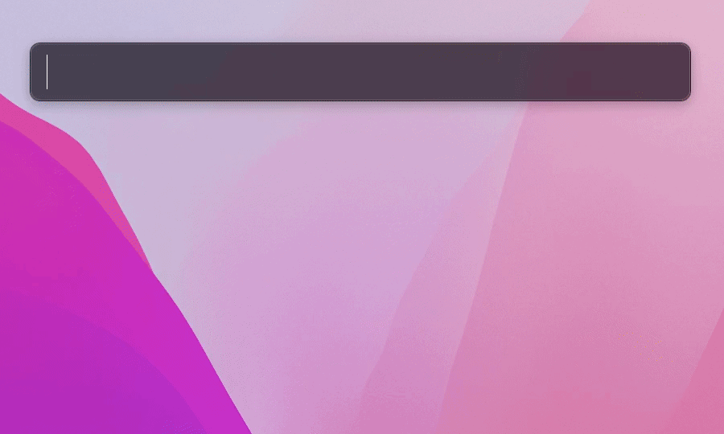
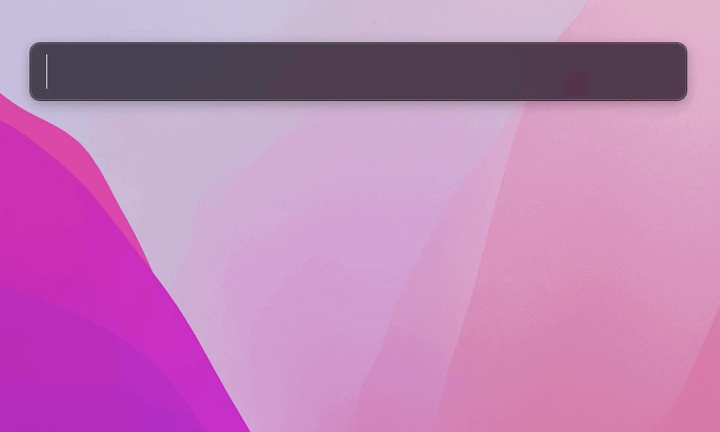

# Alfred themes

Hi there, here are some themes I created for [Alfred](https://www.alfredapp.com/). Note that they require the [Alfred Powerpack](https://www.alfredapp.com/powerpack/). I hope you like them.

* [Neon Dark](#neon-dark)
* [A Scanner Darkly](#a-scanner-darkly)

## Neon Dark

Download and open [Neon Dark.alfredappearance](Neon%20Dark.alfredappearance) or install from [alfredapp.com](https://www.alfredapp.com/extras/theme/HrNenQ86H5/)

## A Scanner Darkly

Download and open [A Scanner Darkly.alfredappearance](A%20Scanner%20Darkly.alfredappearance) or install from [alfredapp.com](https://www.alfredapp.com/extras/theme/KySTami9k3/)
