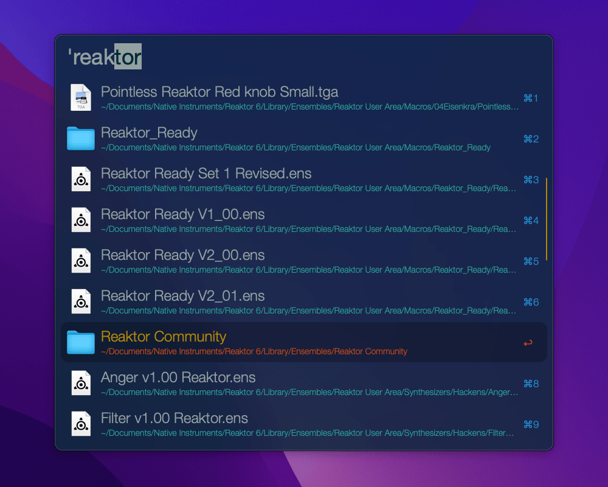
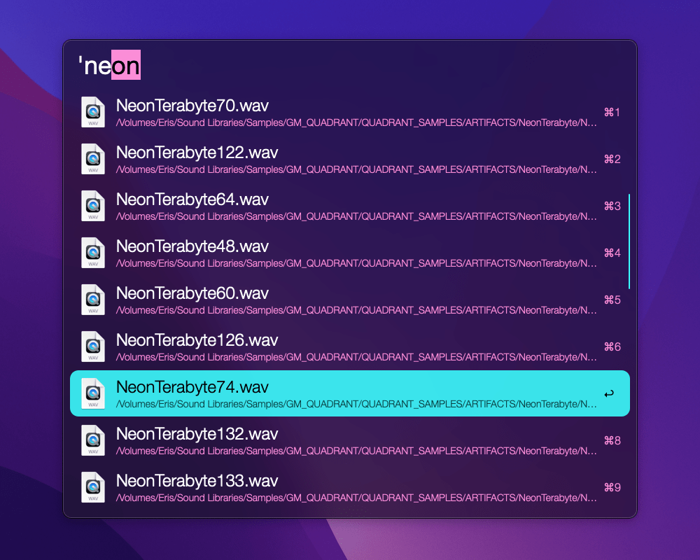
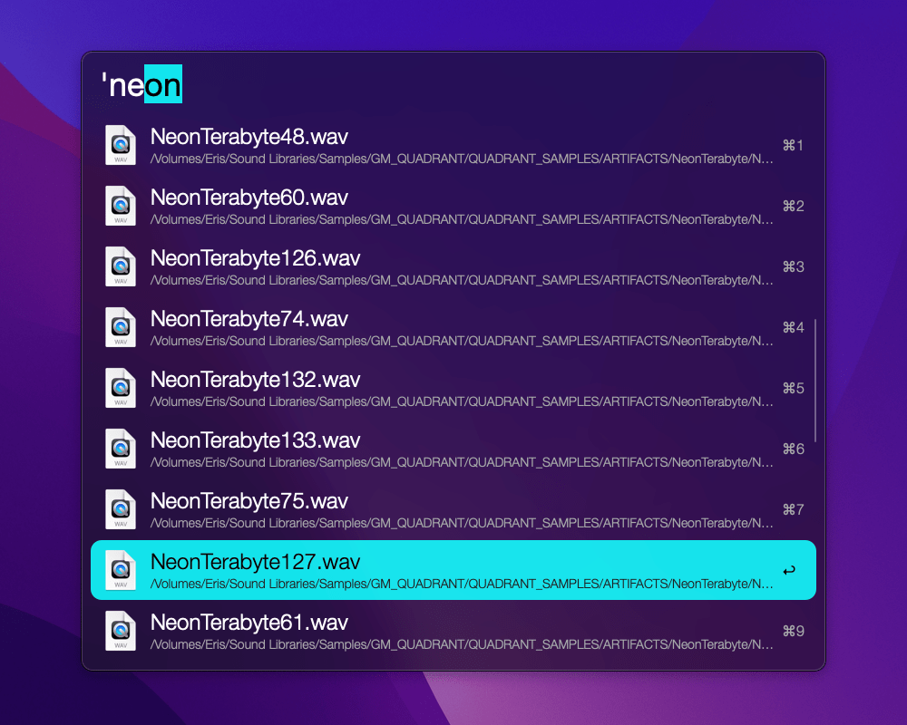
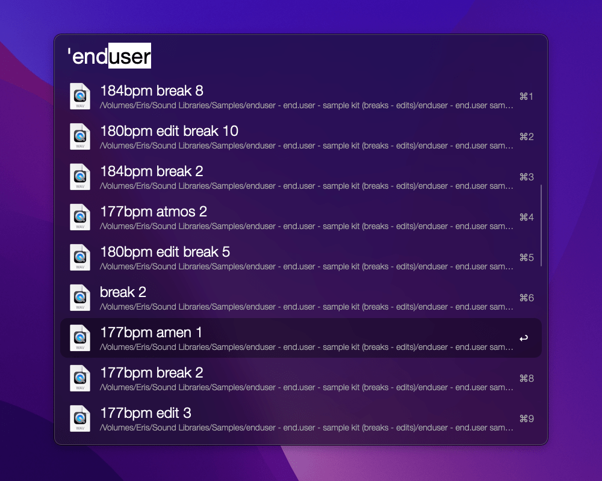

# Alfred themes

Hi there, here's a collection of themes that I created for [Alfred](https://www.alfredapp.com/). Note that they require the [Alfred Powerpack](https://www.alfredapp.com/powerpack/). I hope you like them.

* [Solarized Dark](#solarized-dark)
* [Neon Carnation](#neon-carnation)
* [Neon Dark](#neon-dark)
* [A Scanner Darkly](#a-scanner-darkly)

## Solarized Dark

Download and open [Solarized Dark.alfredappearance](Solarized%20Dark.alfredappearance) or install from [alfredapp.com](https://www.alfredapp.com/extras/theme/TrgrElrig2/)

## Neon Carnation

Download and open [Neon Carnation.alfredappearance](Neon%20Carnation.alfredappearance) or install from [alfredapp.com](https://www.alfredapp.com/extras/theme/SGlWMXaDkb/)

## Neon Dark

Download and open [Neon Dark.alfredappearance](Neon%20Dark.alfredappearance) or install from [alfredapp.com](https://www.alfredapp.com/extras/theme/OuYQSWD8gQ/)

## A Scanner Darkly

Download and open [A Scanner Darkly.alfredappearance](A%20Scanner%20Darkly.alfredappearance) or install from [alfredapp.com](https://www.alfredapp.com/extras/theme/wytDoMHy3Q/)
